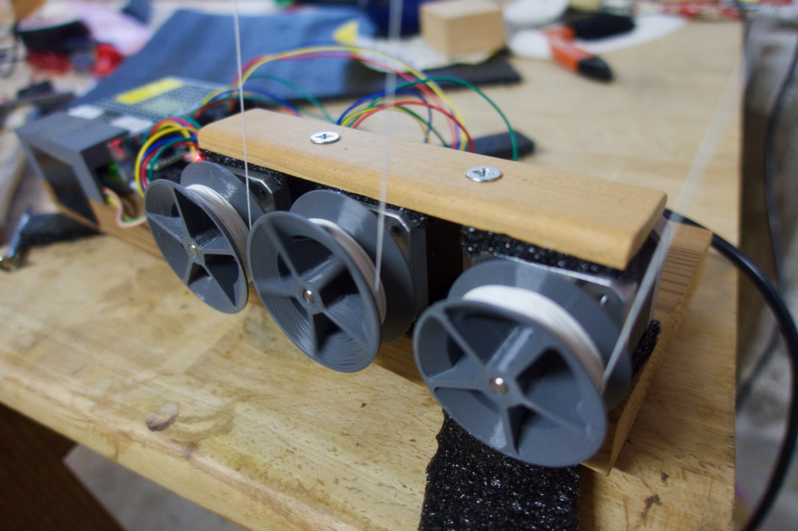
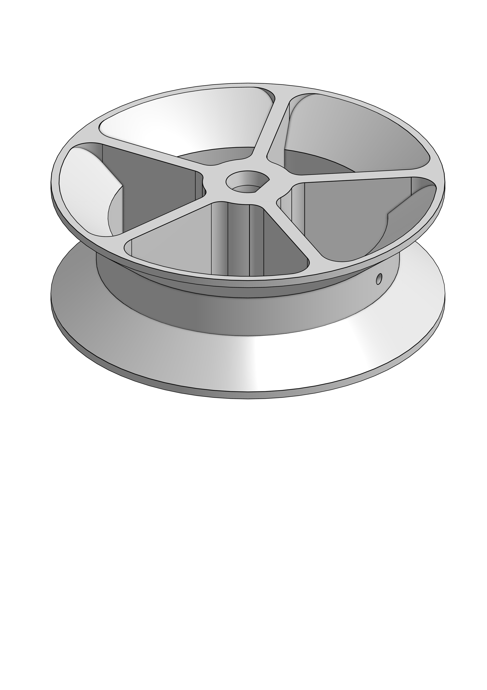
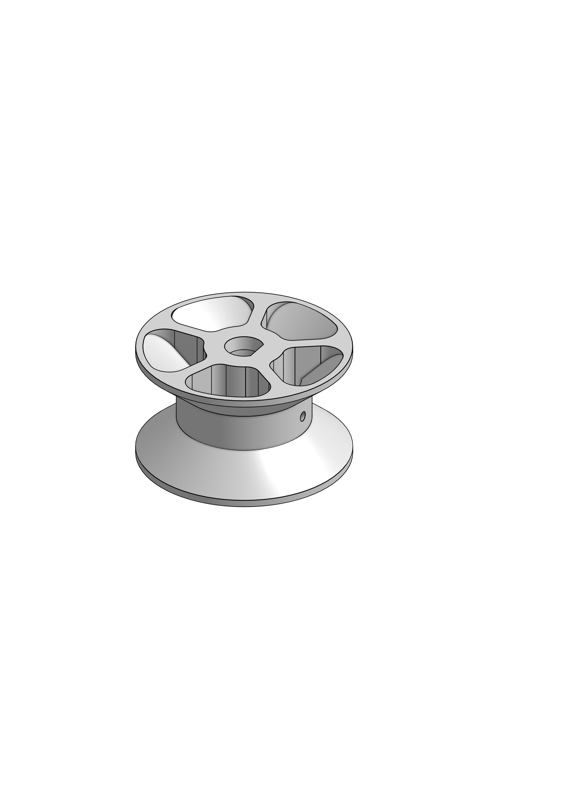
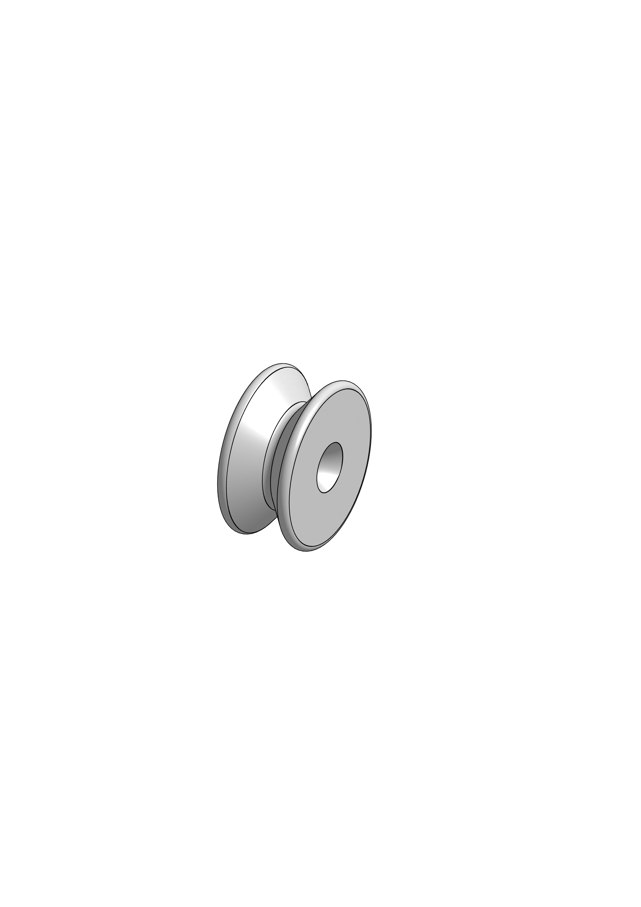
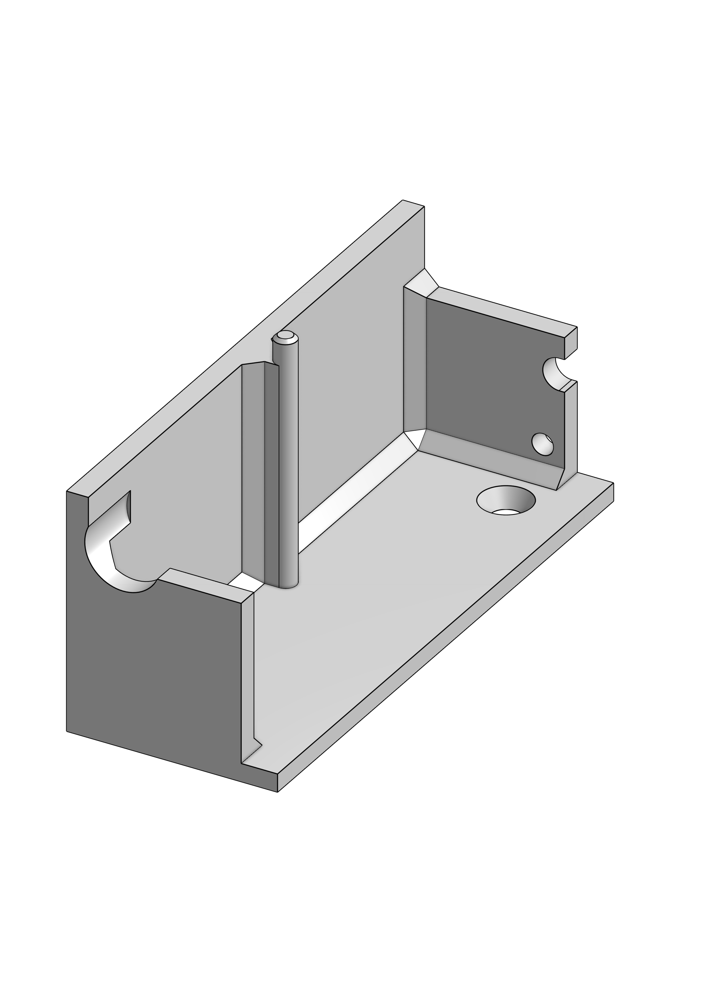
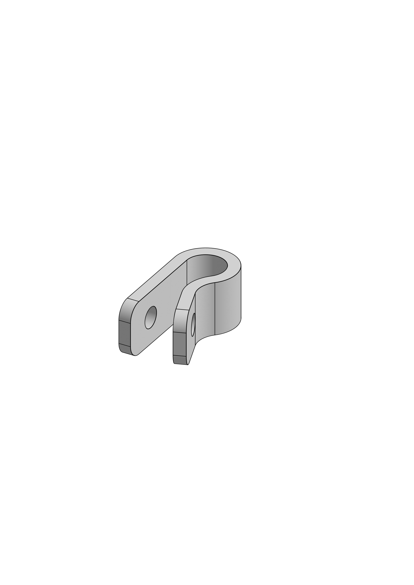
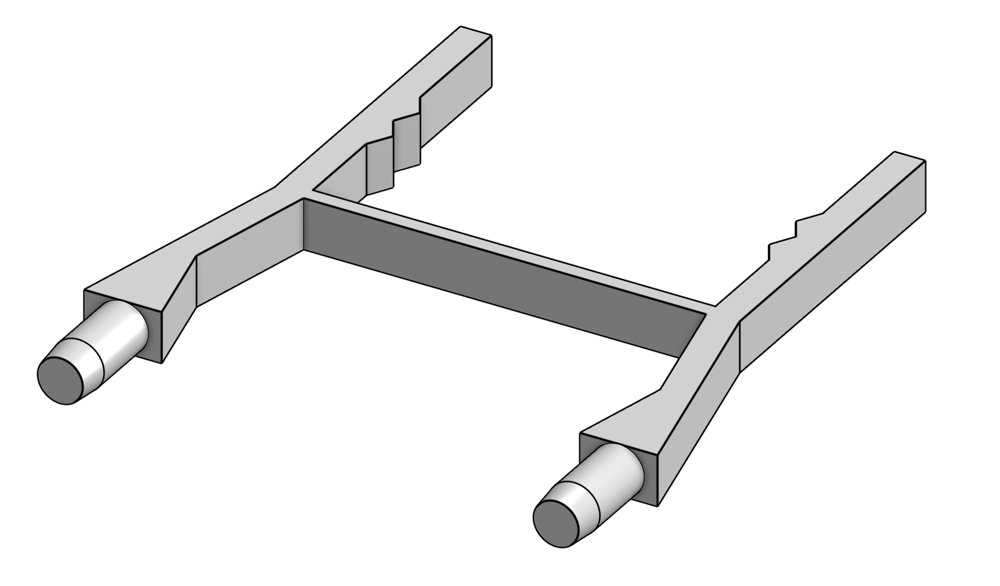

Köbi: Robotic Puppeteering
==========================

Köbi is a 6-channel wireless stepper controller consisting of a [SparkFun ESP32 Thing](https://www.sparkfun.com/products/13907) (red) and a **breakout shield** (white). The latter is inspired by [RAMPS](https://reprap.org/wiki/Arduino_Mega_Pololu_Shield) and accomodates six stepper motor drivers ([TMC2130 StepSticks](https://shop.watterott.com/SilentStepStick-TMC2130), green), optical endstop sensors and fan control.

The software on the ESP32 provides an [OSC (Open Sound Control)](https://en.wikipedia.org/wiki/Open_Sound_Control) server. This, in combination with a matching tablet GUI for the modular [TouchOSC](https://hexler.net/products/touchosc) app allows easy control of the steppers (which are the six thread spools).

Alternatively, the module can be controlled by any other OSC client. The OSC endpoints are documented at the [end of this page](#osc-api).

Features
--------

- 500g per thread
- Velocities up to 2m/s
- Wireless control
- Sub-centimeter precision
- (Almost) unlimited thread lengths
- Position and speed feedback for every channel
- Self-calibration using optical markers on the threads (TODO)
- Motor drivers configured using SPI, allowing for:
    - Microstepping reconfiguration (during operation)
    - Current control
    - Load estimation (TODO)
    - Count of missed steps if overload occurs (TODO)
- Easily extendable code written in [Micropython](https://micropython.org)
- Wireless console (WEBREPL) and code update (FTP)
- Additional I2C / SPI / GPIOs broken out

There are a ton of things you can hook it to. Feel free to reuse!

Software + Firmware
-------------------

The ESP32-Board runs a **special build** of the Micropython firmware due to two requirements:

- The PWM hardware module, which generates the **pulses for the  stepper motors**, is currently not supported by Micropython. This special build includes a Python module supporting it, implemented in C: The [MCPWM](https://github.com/bskp/micropython_esp32_mcpwm) module.

- The Python module for the **Trinamic TMC steppper drivers** (which holds names and descriptions to dozens of its registers) had to be frozen in order to save memory: The [TMC]() module. (TODO: Not published yet)

How much do you need? To get you started with the software, each of this three guides covers a different level:
1. **[Getting started](getting_started.md)**: Setup and interact with Köbi _using a tablet_ and the default OSC API
2. **[Hacking](hacking.md)**: Extend Köbis functionality _by modifying the Micropython_ code running the ESP32
3. **[Developing](developing.md)**: Modify the _Micropython firmware (written in C)_ to improve on the modules [MCPWM]() or [TMC](). These are part of the modified Micropython built, ie. "frozen"

Hardware
--------

This repo also supplies you with everything needed to build your own Köbi.

### Bill of Ordering Materials

| Thing                 | Brand    | Part      | Source          | Price |
|-----------------------|----------|-----------|-----------------|-------|
| Steppers (5-pack)     | Hanpose  | 17HS4401  | AliExpress      | 38.-  |
| Voltage Supply (120W) | GYU&PW   | S-120-24  | AliExpress      | 13.-  |
| ESP32 Thing           | SparkFun | DEV-13907 | [bastelgarage](https://www.bastelgarage.ch/sparkfun-esp32-thing) | 22.- |

SN74LS138N

- bom: steppers, supply, esp32, tmcs, pcb/components, wall plug

### 3D Printed Parts

**Thread Spool (40mm)**: [.stl](parts/Sp40A.stl)

 
- stl, link zu onshape

### Printed Circuit Board
- PCB-Daten als pdf, gerber und kicad.

Ideas
-----

- [x] Coordinated 2-axis movements
- [ ] Load visualization
- [ ] Presets with persistent storage
- [ ] Self-calibration with markers
- [x] Sequencer (Sine and jitter movements)
- [x] Coordinated movements for more than 2 axes
- [ ] Inverse kinematics
