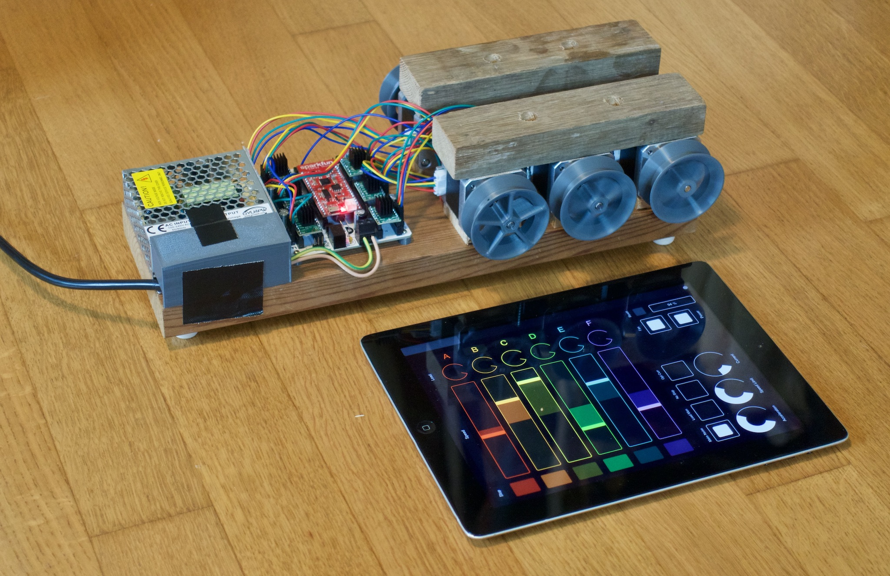

# Köbi: Robotic puppeteering


Köbi is a 6-channel wireless stepper controller consisting of a [SparkFun ESP32 Thing](https://www.sparkfun.com/products/13907) and a **breakout shield**. The latter is inspired by [RAMPS](https://reprap.org/wiki/Arduino_Mega_Pololu_Shield) and accomodates six stepper motor drivers ([TMC2130 StepSticks](https://shop.watterott.com/SilentStepStick-TMC2130), optical endstop sensors and fan control.

The software on the ESP32 provides an [OSC (Open Sound Control)](https://en.wikipedia.org/wiki/Open_Sound_Control) server. This, in combination with a matching tablet GUI for the modular [TouchOSC](https://hexler.net/products/touchosc) app allows easy control of the motors (which are the thread spools).



### Features

- 500g per thread
- Velocities up to 2m/s
- Wireless control
- Sub-centimeter precision
- (Almost) unlimited thread lengths
- Position and speed feedback for every channel
- Self-calibration using optical markers on the threads (TODO)
- Motor drivers configured using SPI, allowing for:
    - Microstepping reconfiguration (during operation)
    - Current control
    - Load estimation (TODO)
    - Count of missed steps if overload occurs (TODO)
- Easily extendable code written in [Micropython](https://micropython.org)
- Wireless console (WEBREPL) and code update (FTP)
- Additional I2C / SPI / GPIOs broken out

There are a ton of things you can hook it to. Feel free to reuse!


### Ideas

- [x] Coordinated 2-axis movements
- [ ] Load visualization
- [ ] Presets with persistant storage
- [ ] Self-calibration with markers
- [x] Sequencer (Sine and jitter movements)
- [x] Coordinated movements for more than 2 axes
- [ ] Inverse kinematics

---

## Getting started

Some code had to be made part of a **special built** of the Micropython firmware.

For the **stepper pulse outputs** (the [MCPWM module]()), the functionality is currently not covered by Micropython and had to be implemented in C.

The modules for the **TMC steppper drivers** (which holds names descriptions to dozens of its registers) had to be frozen in order to save memory (the [TMC module]()).

Read more about the MCPWM module or the TMC module on their respective project pages!

Use the [esptool](https://github.com/espressif/esptool) to flash this custom Micropython build on the ESP32. It is easily installed using pip:

```
pip install esptool
```

If you put Micropython on your board for the first time, it should be erased first:

```
esptool.py --chip esp32 --port /dev/ttyUSB0 erase_flash
```

After this, the custom firmware can be flashed:

```
cd (...)/koebi/firmware
esptool.py --chip esp32 --port /dev/ttyUSB0 --baud 406800 write_flash -z --flash_mode dio --flash_freq 40m 0x1000 firmware.bin
``` 

For more information, see the [official Micropython docs](https://micropython.org/download#esp32).

- Pymakr + VS Code, alternativen
- micropy für intellisense
- Wiki-Seiten mit API zu MCPWM, tmc-control


## Hardware

- Bildi 3D-Druck-Teile
- PCB-Daten als pdf, gerber und kicad.

## Developing

- Instructions about submodules and forks for micropython/esp-idf
 