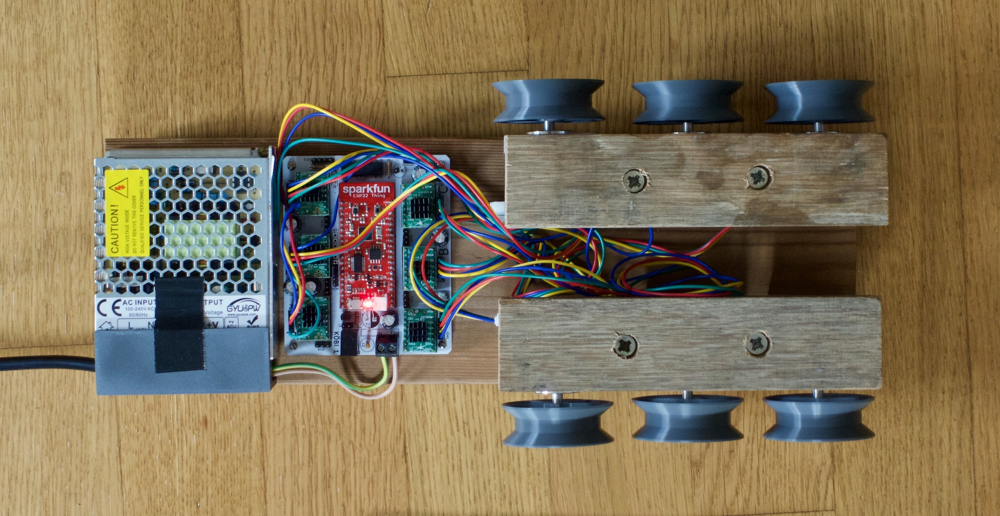
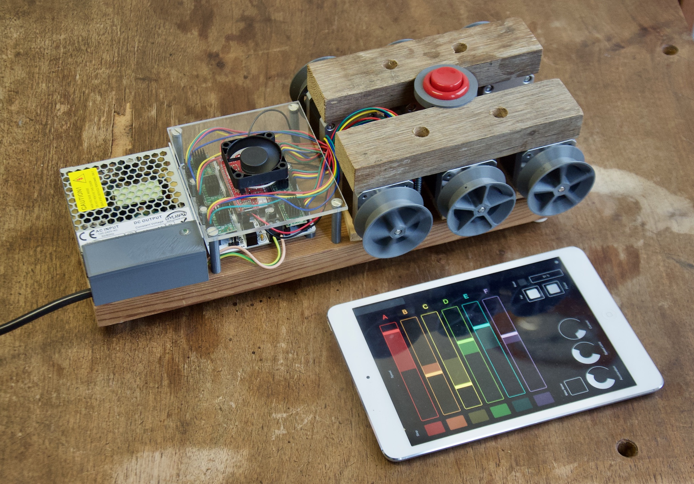

# Köbi: Robotic Puppeteering



Köbi is a 6-channel wireless stepper controller consisting of a [SparkFun ESP32 Thing](https://www.sparkfun.com/products/13907) (red) and a **breakout shield** (white). The latter is inspired by [RAMPS](https://reprap.org/wiki/Arduino_Mega_Pololu_Shield) and accomodates six stepper motor drivers ([TMC2130 StepSticks](https://shop.watterott.com/SilentStepStick-TMC2130), green), optical endstop sensors and fan control.

The software on the ESP32 provides an [OSC (Open Sound Control)](https://en.wikipedia.org/wiki/Open_Sound_Control) server. This, in combination with a matching tablet GUI for the modular [TouchOSC](https://hexler.net/products/touchosc) app allows easy control of the steppers (which are the six thread spools).

Alternatively, the module can be controlled by any other OSC client. The OSC endpoints are documented at the [end of this page](#osc-api).



### Features

- 500g per thread
- Velocities up to 2m/s
- Wireless control
- Sub-centimeter precision
- (Almost) unlimited thread lengths
- Position and speed feedback for every channel
- Self-calibration using optical markers on the threads (TODO)
- Motor drivers configured using SPI, allowing for:
    - Microstepping reconfiguration (during operation)
    - Current control
    - Load estimation (TODO)
    - Count of missed steps if overload occurs (TODO)
- Easily extendable code written in [Micropython](https://micropython.org)
- Wireless console (WEBREPL) and code update (FTP)
- Additional I2C / SPI / GPIOs broken out

There are a ton of things you can hook it to. Feel free to reuse!


### Ideas

- [x] Coordinated 2-axis movements
- [ ] Load visualization
- [ ] Presets with persistant storage
- [ ] Self-calibration with markers
- [x] Sequencer (Sine and jitter movements)
- [x] Coordinated movements for more than 2 axes
- [ ] Inverse kinematics

---

## Getting started

This section explains how to get koebi up and running with the default firmware and tablet GUI. This combination allows to control the **speed** and **position** of the six stepper motors **independently** or **in pairs**.

The ESP32-Board runs a **special build** of the Micropython firmware due to two requirements:

- The PWM hardware module, which generates the **pulses for the  stepper motors**, is currently not supported by Micropython. This special build includes a Python module supporting it, implemented in C: [MCPWM]()

- The Python module for the **Trinamic TMC steppper drivers** (which holds names and descriptions to dozens of its registers) had to be frozen in order to save memory: [TMC]()

For reusability, these two modules have their own project pages – read on there if you need to know more!

### Flashing

Use the [esptool](https://github.com/espressif/esptool) to flash this custom Micropython build on the ESP32. It is easily installed using pip:

```
pip install esptool
```

If you put Micropython on your board for the first time, it should be erased first:

```
esptool.py --chip esp32 --port /dev/ttyUSB0 erase_flash
```

After this, the custom firmware can be flashed:

```
cd (...)/koebi/firmware
esptool.py --chip esp32 --port /dev/ttyUSB0 --baud 406800 write_flash -z --flash_mode dio --flash_freq 40m 0x1000 firmware.bin
``` 

For more information, see the [official Micropython docs](https://micropython.org/download#esp32).

### Setup the TouchOSC GUI
- Install the [TouchOSC](https://hexler.net/products/touchosc) app on a tablet.  
It's a paid app (5.-), sorry about that.

- Install the application to edit layouts, [TouchOSC Editor](https://hexler.net/products/touchosc#downloads), on a computer (free)

- Transfer the ``koebi.touchosc`` (found in ``/gui``) to the tablet. The official documentation walks you through this for [iOS](https://hexler.net/docs/touchosc-configuration-layout-transfer-wifi?ios) and [Android](https://hexler.net/docs/touchosc-configuration-layout-transfer-wifi?android)

To complete the setup, you need to specify a few options on the tablet. Access these by tapping the **dot** at the **top right corner** in the TouchOSC app.

Set the following **Host**:

- Host: ``192.168.4.1`` (which is the ESP32's IP Address)
- Port (outgoing): ``8000``
- Port (incoming): ``9000``

And under **Options**:

- Send Ping (``/ping``): ``On``
- Delay: ``5s`` 

Finally, make sure to connect with the systems WiFi:
- Network name (SSID): ``koebi``
- No security

Upon opening TouchOSC, you should now be able to power up the motors and control them. 

## Developing using VS Code and Pymakr
- Pymakr + VS Code, alternativen
- micropy für intellisense
- Wiki-Seiten mit API zu MCPWM, tmc-control


## Recompile the Micropython build

- When is this necessary?
- Instructions about submodules and forks for micropython/esp-idf

## Hardware

- Bildi 3D-Druck-Teile
- PCB-Daten als pdf, gerber und kicad.

<a name="osc-api"></a>
## Open Sound Control (OSC) API

The following API is implemented in ``remote.py``. 

### Globals

- ``/fan``
- ``/power`` 
- ``/reset`` Trigger a software reset of the ESP32 board (bool)

### Motors
- ``/all/curr`` 

 